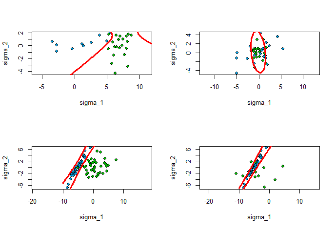

## Наивный Байесовский классификатор (NBC)
___
  
```R
naiveBayes <- function(xl, x, lambda, h)
{
  aprior_prob <- c()
  apost_prob <- c()
  prob <- c()
  classXl <- levels(xl$Species)     
  n <- dim(xl)[2]-1
  
  for(y in 1:length(classXl))
  {
    sub_xl <- xl[xl$Species == classXl[y], ]
    m <- nrow(sub_xl)
    aprior_prob[y] <- m / dim(xl)[1]
    
    sum <- 0
    for(j in 1:m)
    {
      apost_value <- 1
      for(i in 1:n)
      {
        kerneRes <- kerne((x[i] - sub_xl[j,i]) / h[i], ker.type[7]) / h[i]
        apost_value <- apost_value * kerneRes
      }
      sum <- sum + apost_value
    }
    apost_prob[y] <- sum / m
    
    prob[y] <- log(lambda[y]*aprior_prob[y]) + log(apost_prob[y]) 
  }   
  return(levels(xl$Species)[match(max(prob), prob)])
}
```

## Plug-In
___

```R
## Получение коэффициентов подстановочного алгоритма
getPlugInDiskriminantCoeffs <- function(mu1, sigma1, mu2, sigma2)
{
  ## Line equation: a*x1^2 + b*x1*x2 + c*x2 + d*x1 + e*x2 + f = 0
  invSigma1 <- solve(sigma1)
  invSigma2 <- solve(sigma2)
  f <- log(abs(det(sigma1))) - log(abs(det(sigma2))) +
    mu1 %*% invSigma1 %*% t(mu1) - mu2 %*% invSigma2 %*%
    t(mu2);
  alpha <- invSigma1 - invSigma2
  a <- alpha[1, 1]
  b <- 2 * alpha[1, 2]
  c <- alpha[2, 2]
  beta <- invSigma1 %*% t(mu1) - invSigma2 %*% t(mu2)
  d <- -2 * beta[1, 1]
  e <- -2 * beta[2, 1]
  return (c("x^2" = a, "xy" = b, "y^2" = c, "x" = d, "y"
            = e, "1" = f))
}
```

## LDF
___

```R
## Оценка ковариационной матрицы для ЛДФ
estimateFisherCovarianceMatrix <- function(objects1, objects2, mu1, mu2)
{
	rows1 <- dim(objects1)[1]
	rows2 <- dim(objects2)[1]
	rows <- rows1 + rows2
	cols <- dim(objects1)[2]
	sigma <- matrix(0, cols, cols)
	for (i in 1:rows1)
	{
		sigma <- sigma + (t(objects1[i,] - mu1) %*%
		(objects1[i,] - mu1)) / (rows + 2)
	}
	for (i in 1:rows2)
	{
		sigma <- sigma + (t(objects2[i,] - mu2) %*%
		(objects2[i,] - mu2)) / (rows + 2)
	}
	return (sigma)
}
```