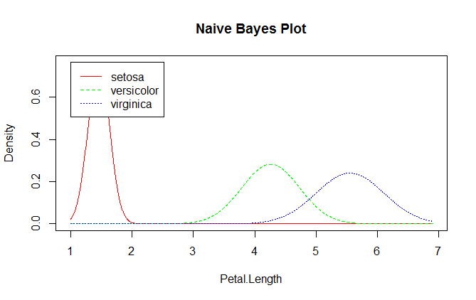

## Naive Bayesian Classifier (NBC)
___
Below is the Naive Bayes’ Theorem:

P(A | B) = P(A) * P(B | A) / P(B)

Which can be derived from the general multiplication formula for AND events:

P(A and B) = P(A) * P(B | A)

P(B | A) = P(A and B) / P(A)

P(B | A) = P(B) * P(A | B) / P(A)

If I replace the letters with meaningful words as I have been adopting throughout, the Naive Bayes formula becomes:

P(outcome | evidence) = P(outcome) * P(evidence | outcome) / P(evidence)

It is with this formula that the Naive Bayes classifier calculates conditional probabilities for a class outcome given prior information.

The reason it is termed “naive” is because we assume independence between attributes when in reality they may be dependent in some way.

So let`s try to implement the naive Bayesian classifier and see what we get.
Before you use the source below you need install several packages & load some libraries...

```R
install.packages("caret")
install.packages("MASS")
install.packages("klaR")
require("caret")
require(lattice)
require(ggplot2)
require(klaR)
require(MASS)
require(e1071) #predict
```

Loading data & Creating the model

```R
data("iris")
model <- NaiveBayes(Species ~ ., data = iris)
```

**predict** computes the conditional a-posterior probabilities of a categorical class variable given independent predictor variables using the Bayes rule.

```R
preds <- predict(model, iris[,-5])
```

Here they are

```R
$class
  [1] setosa     setosa     setosa     setosa     setosa     setosa     setosa    
  [8] setosa     setosa     setosa     setosa     setosa     setosa     setosa    
 [15] setosa     setosa     setosa     setosa     setosa     setosa     setosa
 ...
[141] virginica  virginica  virginica  virginica  virginica  virginica  virginica 
[148] virginica  virginica  virginica 
Levels: setosa versicolor virginica

 $posterior
              setosa   versicolor    virginica
  [1,]  1.000000e+00 2.981309e-18 2.152373e-25
  [2,]  1.000000e+00 3.169312e-17 6.938030e-25
  [3,]  1.000000e+00 2.367113e-18 7.240956e-26
  ...
[149,] 1.439996e-195 3.384156e-07 9.999997e-01
[150,] 2.771480e-143 5.987903e-02 9.401210e-01
```

The last one, we need to know how many error classified, so we need to compare the result of prediction with the class/iris species.

```R
table(predict(model, iris[,-5])$class, iris[,5])

##             y
##              setosa versicolor virginica
##   setosa         50          0         0
##   versicolor      0         47         3
##   virginica       0          3        47
```

If you want to plot the features with Naive Bayes, you can use this command:

```R
naive_iris <- NaiveBayes(iris$Species ~ ., data = iris)
plot(naive_iris)
```




## Plug-In
___
<!--
В задачах классификации с гауссовскими классами параметры функций правдоподобия µˆy и Σy

можно оценить по частям обучающей выборки

для каждого класса y отдельно. Оцениваются априорные вероятности классов Py. Полученные выборочные оценки непосредственно подставляются в формулу

В результате получается алгоритм классификации, который так и называетсяподстановочным (plug-in).
-->

```R
## Получение коэффициентов подстановочного алгоритма
getPlugInDiskriminantCoeffs <- function(mu1, sigma1, mu2, sigma2)
{
  ## Line equation: a*x1^2 + b*x1*x2 + c*x2 + d*x1 + e*x2 + f = 0
  invSigma1 <- solve(sigma1)
  invSigma2 <- solve(sigma2)
  f <- log(abs(det(sigma1))) - log(abs(det(sigma2))) +
    mu1 %*% invSigma1 %*% t(mu1) - mu2 %*% invSigma2 %*%
    t(mu2);
  alpha <- invSigma1 - invSigma2
  a <- alpha[1, 1]
  b <- 2 * alpha[1, 2]
  c <- alpha[2, 2]
  beta <- invSigma1 %*% t(mu1) - invSigma2 %*% t(mu2)
  d <- -2 * beta[1, 1]
  e <- -2 * beta[2, 1]
  return (c("x^2" = a, "xy" = b, "y^2" = c, "x" = d, "y"
            = e, "1" = f))
}
```

## LDF
___

```R
## Оценка ковариационной матрицы для ЛДФ
estimateFisherCovarianceMatrix <- function(objects1, objects2, mu1, mu2)
{
	rows1 <- dim(objects1)[1]
	rows2 <- dim(objects2)[1]
	rows <- rows1 + rows2
	cols <- dim(objects1)[2]
	sigma <- matrix(0, cols, cols)
	for (i in 1:rows1)
	{
		sigma <- sigma + (t(objects1[i,] - mu1) %*%
		(objects1[i,] - mu1)) / (rows + 2)
	}
	for (i in 1:rows2)
	{
		sigma <- sigma + (t(objects2[i,] - mu2) %*%
		(objects2[i,] - mu2)) / (rows + 2)
	}
	return (sigma)
}
```