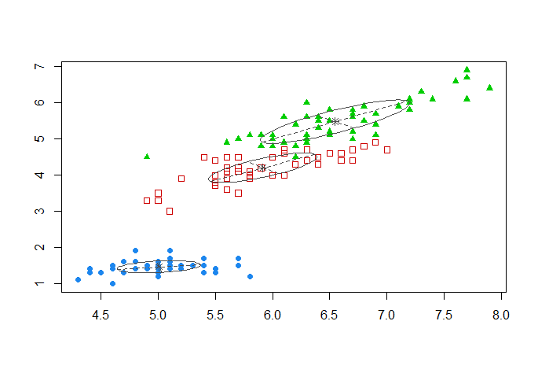

<!-- Component-Wise EM Algorithm for Mixtures -->
## EM algorithm
___
In statistics, an **_expectation–maximization (EM) algorithm_** is an iterative method to find maximum likelihood or maximum a posteriori (MAP) estimates of parameters in statistical models, where the model depends on unobserved latent variables. The EM iteration alternates between performing an expectation (E) step, which creates a function for the expectation of the log-likelihood evaluated using the current estimate for the parameters, and a maximization (M) step, which computes parameters maximizing the expected log-likelihood found on the E step. These parameter-estimates are then used to determine the distribution of the latent variables in the next E step.

It is based upon probabilistic model building with partial observations

Likelihood Function


The Likelihood Function finds the best model given the data.


_expectation-maximization (EM) algorithm_

This is how we can cluster the data...

```R
require(mclust) #Mclust

data(iris)

mc <- Mclust(iris[,1:4],G=3) # 3 clusters
plot(mc, what=c("classification"), dimens=c(1,3)) # using 1st and 3rd column of the iris dataset
mc$parameters$mean # centers of clusters #eq to t(irisCluster$centers)
mc$G # number of clusters

irisCluster <- kmeans(iris[,1:4],3)
```




## RBF
___
This model constitutes an adaptation of the classical RBF network where the outputs represent the class conditional distributions. Since the network outputs correspond to probability density functions, training process is treated as maximum likelihood problem and an expectation-maximization (EM) algorithm is proposed for adjusting the network parameters. Experimental results show that proposed architecture exhibits superior classification performance compared to the classical RBF network.

Let’s implement this in R

```R
# returns a rbf model given the:
# * observations x1, xN of dataset D
# * output value for each observation
# * number of centers
# * gamma value

rbf <- function(X, Y, K=10, gamma=1.0) {
  N     <- dim(X)[1] # number of observations
  ncols <- dim(X)[2] # number of variables
  
  repeat {
    km <- kmeans(X, K)  # let's cluster K centers out of the dataset
    if (min(km$size)>0) # only accept if there are no empty clusters
      break
  }

  mus <- km$centers # the clusters points
  
  Phi <- matrix(rep(NA,(K+1)*N), ncol=K+1)
  for (lin in 1:N) {
    Phi[lin,1] <- 1    # bias column
    for (col in 1:K) {
      Phi[lin,col+1] <- exp( -gamma * norm(as.matrix(X[lin,]-mus[col,]),"F")^2 )
    }
  }
  
  w <- pseudoinverse(t(Phi) %*% Phi) %*% t(Phi) %*% Y  # find RBF weights

  list(weights=w, centers=mus, gamma=gamma)  # return the rbf model
}
```

And also an implementation for the prediction function:

```R
rbf.predict <- function(model, X, classification=FALSE) {
  
  gamma   <- model$gamma
  centers <- model$centers
  w       <- model$weights
  N       <- dim(X)[1]    # number of observations
  
  pred <- rep(w[1],N)  # we need to init to a value, so let's start with the bias

  for (j in 1:N) {  
    # find prediction for point xj
    for (k in 1:length(centers[,1])) {
      # the weight for center[k] is given by w[k+1] (because w[1] is the bias)
      pred[j] <- pred[j] + w[k+1] * exp( -gamma * norm(as.matrix(X[j,]-centers[k,]),"F")^2 )
    }
  }
  
  if (classification) {
    pred <- unlist(lapply(pred, sign))
  }
  pred
}
```

Let’s see an example:

```R
target <- function(x1, x2) {
  2*(x2 - x1 + .25*sin(pi*x1) >= 0)-1
}

N <- 100
X <- data.frame(x1=runif(N, min=-1, max=1),
                x2=runif(N, min=-1, max=1))
Y <- target(X$x1, X$x2)
plot(X$x1, X$x2, col=Y+3)
```


Now let’s learn the dataset using the RBFs:

```R
rbf.model <- rbf(X, Y) # using default values for K and gamma
rbf.model

## $weights
##             [,1]
##  [1,] -4.1869647
##  [2,] -2.0964171
##  [3,]  2.1608708
##  [4,]  8.3543678
##  [5,] -4.8642154
##  [6,]  0.6223674
##  [7,] -0.6106960
##  [8,]  3.5330173
##  [9,] -6.3038222
## [10,]  5.8279082
## [11,]  7.5053400
## 
## $centers
##             x1         x2
## 1   0.79089169 -0.2369843
## 2   0.68147040  0.8154599
## 3  -0.73936896  0.5569151
## 4   0.17883923 -0.1770207
## 5  -0.59411279 -0.2094878
## 6  -0.02798912 -0.7536152
## 7  -0.73454084 -0.7268801
## 8  -0.42022077  0.6182727
## 9   0.75134910 -0.8170974
## 10  0.25960235  0.3975370
## 
## $gamma
## [1] 1
```

And make a prediction over a new test set:

```R
N.test <- 200
X.out <- data.frame(x1=runif(N.test, min=-1, max=1),
                    x2=runif(N.test, min=-1, max=1))
Y.out <- target(X.out$x1, X.out$x2)

rbf.pred <- rbf.predict(rbf.model, X.out, classification=TRUE)
binary.error <- sum(rbf.pred != Y.out)/N.test
binary.error

## [1] 0.1

plot(X.out$x1, X.out$x2, col=Y.out+3, pch=0)
points(X.out$x1, X.out$x2, col=rbf.pred+3, pch=3)
points(rbf.model$centers, col="black", pch=19) # draw the model centers
legend("topleft",c("true value","predicted"),pch=c(0,3),bg="white")
```

