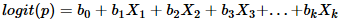

# Linear classification algorithms
___

## Adaline
___
ADALINE stands for **Ada**ptive **Lin**ear **E**lement. It was developed by Professor Bernard Widrow and his graduate student Ted Hoff at Stanford University in 1960. It is based on the McCulloch-Pitts model and consists of a weight, a bias and a summation function.

Operation: 

Its adaptation is defined through a cost function (error metric) of the residual  where  is the desired input. With the MSE error metric  adapted weight and bias become:  and 

The Adaline has practical applications in the controls area. A single neuron with tap delayed inputs (the number of inputs is bounded by the lowest frequency present and the Nyquist rate) can be used to determine the higher order transfer function of a physical system via the bi-linear z-transform. This is done as the Adaline is, functionally, an adaptive FIR filter. Like the single-layer perceptron, ADALINE has a counterpart in statistical modelling, in this case least squares regression.


```R
## Квадратичная функция потерь
lossQuad <- function(x)
{
  return ((x-1)^2)
}
## Стохастический градиент для ADALINE
sg.ADALINE <- function(xl, eta = 1, lambda = 1/6)
{
	l <- dim(xl)[1]
	n <- dim(xl)[2] - 1
	w <- c(1/2, 1/2, 1/2)
	iterCount <- 0
	## initialize Q
	Q <- 0
	for (i in 1:l)
	{
	  ## calculate the scalar product <w,x>
	  wx <- sum(w * xl[i, 1:n])
	  ## calculate a margin
	  margin <- wx * xl[i, n + 1]
	  Q <- Q + lossQuad(margin)
	}
	repeat
	{
	  ## calculate the margins for all objects of the training sample
	  margins <- array(dim = l)
	 
	  for (i in 1:l)
	  {
		xi <- xl[i, 1:n]
		yi <- xl[i, n + 1]
		margins[i] <- crossprod(w, xi) * yi
	  }
	  ## select the error objects
	  errorIndexes <- which(margins <= 0)
	  if (length(errorIndexes) > 0)
	  {
		# select the random index from the errors
		i <- sample(errorIndexes, 1)
		iterCount <- iterCount + 1
		xi <- xl[i, 1:n]
		yi <- xl[i, n + 1]
		## calculate the scalar product <w,xi>
		wx <- sum(w * xi)
		## make a gradient step
		margin <- wx * yi
		## calculate an error
		ex <- lossQuad(margin)
		eta <- 1 / sqrt(sum(xi * xi))
		w <- w - eta * (wx - yi) * xi
		## Calculate a new Q
		Qprev <- Q
		Q <- (1 - lambda) * Q + lambda * ex
	  }
	  else
	  {
		break
	  }
	}
	return (w)
}
```

## Hebb
___
From the point of view of artificial neurons and artificial neural networks, Hebb's principle can be described as a method of determining how to alter the weights between model neurons. The weight between two neurons increases if the two neurons activate simultaneously, and reduces if they activate separately. Nodes that tend to be either both positive or both negative at the same time have strong positive weights, while those that tend to be opposite have strong negative weights.

The following is a formulaic description of Hebbian learning:


Another formulaic description is:


Hebb's Rule is often generalized as  


```R
## Функция потерь для правила Хэбба
lossPerceptron <- function(x)
{
	return (max(-x, 0))
}
## Стохастический градиент с правилом Хебба
sg.Hebb <- function(xl, eta = 0.1, lambda = 1/6)
{
	l <- dim(xl)[1]
	n <- dim(xl)[2] - 1
	w <- c(1/2, 1/2, 1/2)
	iterCount <- 0
	## initialize Q
	Q <- 0
	for (i in 1:l)
	{
		## calculate the scalar product <w,x>
		wx <- sum(w * xl[i, 1:n])
		## calculate a margin
		margin <- wx * xl[i, n + 1]
		# Q <- Q + lossQuad(margin)
		Q <- Q + lossPerceptron(margin)
	}
	repeat
	{
		## Поиск ошибочных объектов
		margins <- array(dim = l)
		for (i in 1:l)
		{
			xi <- xl[i, 1:n]
			yi <- xl[i, n + 1]
			margins[i] <- crossprod(w, xi) * yi
		}
		## выбрать ошибочные объекты
		errorIndexes <- which(margins <= 0)
		if (length(errorIndexes) > 0)
		{
			# выбрать случайный ошибочный объект
			i <- sample(errorIndexes, 1)
			iterCount <- iterCount + 1
			xi <- xl[i, 1:n]
			yi <- xl[i, n + 1]
			w <- w + eta * yi * xi
		}
		else
		break;
	}
	return (w)
}
```

## LogRegression
___
_**Logistic**_ regression is a statistical method for analyzing a dataset in which there are one or more independent variables that determine an outcome. The outcome is measured with a dichotomous variable (in which there are only two possible outcomes).

_**In logistic regression, the dependent variable is binary or dichotomous, i.e. it only contains data coded as 1 (TRUE, success, pregnant, etc.) or 0 (FALSE, failure, non-pregnant, etc.).**_

The goal of logistic regression is to find the best fitting (yet biologically reasonable) model to describe the relationship between the dichotomous characteristic of interest (dependent variable = response or outcome variable) and a set of independent (predictor or explanatory) variables. Logistic regression generates the coefficients (and its standard errors and significance levels) of a formula to predict a logit transformation of the probability of presence of the characteristic of interest:




```R
## Логарифмическая функция потерь
lossLog <- function(x)
{
	return (log2(1 + exp(-x)))
}
## Сигмоидная функция
lossSigmoid <- function(z)
{
	return (1 / (1 + exp(-z)))
}
## Стохастический градиент для логистической регрессии
sg.LogRegression <- function(xl)
{
	l <- dim(xl)[1]
	n <- dim(xl)[2] - 1
	w <- c(1/2, 1/2, 1/2)
	iterCount <- 0
	lambda <- 1/l
	## initialize Q
	Q <- 0
	for (i in 1:l)
	{
		## calculate the scalar product <w,x>
		wx <- sum(w * xl[i, 1:n])
		## calculate a margin
		margin <- wx * xl[i, n + 1]
		Q <- Q + lossSigmoid(margin)
	}
	repeat
	{
		# select the random index from the error objects errorIndexes
		i <- sample(1:l, 1)
		iterCount <- iterCount + 1
		# i <- sample(1:l, 1)
		xi <- xl[i, 1:n]
		yi <- xl[i, n + 1]
		## calculate the scalar product <w,xi>
		wx <- sum(w * xi)
		## make a gradient step
		margin <- wx * yi
		ex <- lossSigmoid(margin)
		eta <- 0.3#1 / iterCount
		w <- w + eta * xi * yi * lossSigmoid(-wx * yi)
		## Calculate a new Q
		Qprev <- Q
		Q <- (1 - lambda) * Q + lambda * ex
		if (abs(Qprev - Q) / abs(max(Qprev, Q)) < 1e-5)
		break
	}
	return (w)
}
```
### Comparison
___
