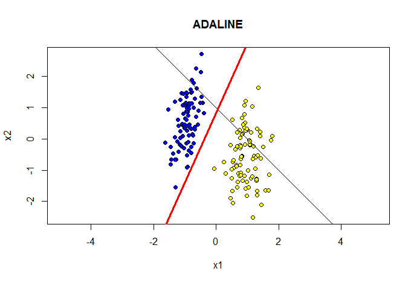
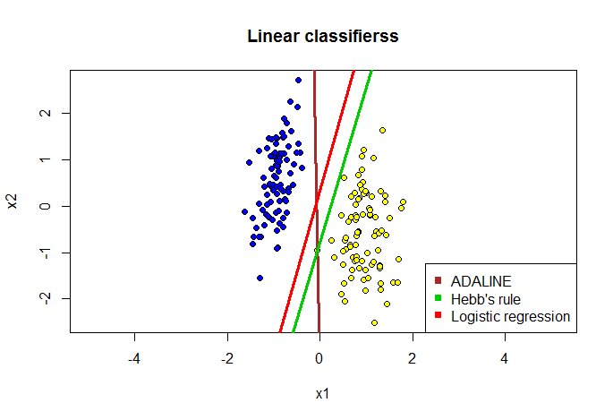

# Linear classification algorithms
___

## Adaline
___
ADALINE stands for **Ada**ptive **Lin**ear **E**lement. It was developed by Professor Bernard Widrow and his graduate student Ted Hoff at Stanford University in 1960. It is based on the McCulloch-Pitts model and consists of a weight, a bias and a summation function.

Operation: 


```R
## Квадратичная функция потерь
lossQuad <- function(x)
{
  return ((x-1)^2)
}
## Стохастический градиент для ADALINE
sg.ADALINE <- function(xl, eta = 1, lambda = 1/6)
{
	l <- dim(xl)[1]
	n <- dim(xl)[2] - 1
	w <- c(1/2, 1/2, 1/2)
	iterCount <- 0
	## initialize Q
	Q <- 0
	for (i in 1:l)
	{
	  ## calculate the scalar product <w,x>
	  wx <- sum(w * xl[i, 1:n])
	  ## calculate a margin
	  margin <- wx * xl[i, n + 1]
	  Q <- Q + lossQuad(margin)
	}
	repeat
	{
	  ## calculate the margins for all objects of the training sample
	  margins <- array(dim = l)
	 
	  for (i in 1:l)
	  {
		xi <- xl[i, 1:n]
		yi <- xl[i, n + 1]
		margins[i] <- crossprod(w, xi) * yi
	  }
	  ## select the error objects
	  errorIndexes <- which(margins <= 0)
	  if (length(errorIndexes) > 0)
	  {
		# select the random index from the errors
		i <- sample(errorIndexes, 1)
		iterCount <- iterCount + 1
		xi <- xl[i, 1:n]
		yi <- xl[i, n + 1]
		## calculate the scalar product <w,xi>
		wx <- sum(w * xi)
		## make a gradient step
		margin <- wx * yi
		## calculate an error
		ex <- lossQuad(margin)
		eta <- 1 / sqrt(sum(xi * xi))
		w <- w - eta * (wx - yi) * xi
		## Calculate a new Q
		Qprev <- Q
		Q <- (1 - lambda) * Q + lambda * ex
	  }
	  else
	  {
		break
	  }
	}
	return (w)
}
```

## Hebb
___

```R
## Функция потерь для правила Хэбба
lossPerceptron <- function(x)
{
	return (max(-x, 0))
}
## Стохастический градиент с правилом Хебба
sg.Hebb <- function(xl, eta = 0.1, lambda = 1/6)
{
	l <- dim(xl)[1]
	n <- dim(xl)[2] - 1
	w <- c(1/2, 1/2, 1/2)
	iterCount <- 0
	## initialize Q
	Q <- 0
	for (i in 1:l)
	{
		## calculate the scalar product <w,x>
		wx <- sum(w * xl[i, 1:n])
		## calculate a margin
		margin <- wx * xl[i, n + 1]
		# Q <- Q + lossQuad(margin)
		Q <- Q + lossPerceptron(margin)
	}
	repeat
	{
		## Поиск ошибочных объектов
		margins <- array(dim = l)
		for (i in 1:l)
		{
			xi <- xl[i, 1:n]
			yi <- xl[i, n + 1]
			margins[i] <- crossprod(w, xi) * yi
		}
		## выбрать ошибочные объекты
		errorIndexes <- which(margins <= 0)
		if (length(errorIndexes) > 0)
		{
			# выбрать случайный ошибочный объект
			i <- sample(errorIndexes, 1)
			iterCount <- iterCount + 1
			xi <- xl[i, 1:n]
			yi <- xl[i, n + 1]
			w <- w + eta * yi * xi
		}
		else
		break;
	}
	return (w)
}
```

## LogRegression
___

```R
## Логарифмическая функция потерь
lossLog <- function(x)
{
	return (log2(1 + exp(-x)))
}
## Сигмоидная функция
lossSigmoid <- function(z)
{
	return (1 / (1 + exp(-z)))
}
## Стохастический градиент для логистической регрессии
sg.LogRegression <- function(xl)
{
	l <- dim(xl)[1]
	n <- dim(xl)[2] - 1
	w <- c(1/2, 1/2, 1/2)
	iterCount <- 0
	lambda <- 1/l
	## initialize Q
	Q <- 0
	for (i in 1:l)
	{
		## calculate the scalar product <w,x>
		wx <- sum(w * xl[i, 1:n])
		## calculate a margin
		margin <- wx * xl[i, n + 1]
		Q <- Q + lossSigmoid(margin)
	}
	repeat
	{
		# select the random index from the error objects errorIndexes
		i <- sample(1:l, 1)
		iterCount <- iterCount + 1
		# i <- sample(1:l, 1)
		xi <- xl[i, 1:n]
		yi <- xl[i, n + 1]
		## calculate the scalar product <w,xi>
		wx <- sum(w * xi)
		## make a gradient step
		margin <- wx * yi
		ex <- lossSigmoid(margin)
		eta <- 0.3#1 / iterCount
		w <- w + eta * xi * yi * lossSigmoid(-wx * yi)
		## Calculate a new Q
		Qprev <- Q
		Q <- (1 - lambda) * Q + lambda * ex
		if (abs(Qprev - Q) / abs(max(Qprev, Q)) < 1e-5)
		break
	}
	return (w)
}
```
### Comparison
___
