# Метрические алгоритмы классификации
___
The main task of which will be considered here is to classify the object (i.e., to determine to which class it belongs) according to the available data (sample), and to do it as reliably as possible.

So, let`s consider the classification algorithms and their distinctive features
All considered algorithms of the metric, i.e. based on some function of distance (in our case Euclidean). We introduce the following notation:

 `xl` - data sample
 
 `u` - classified object
 
 `p` - metric function
 
 `Y` - class
 
## kNN
___
The meaning of the algorithm is very simple. In a nutshell, we say that the object `u` refers to the class of `Yi`, if among the k nearest objects with similar properties more objects belonging to the class of `Yi`. The degree of proximity of each of `k` neighbors are not taken into account, the important fact neighborhood. Visually it shown on the picture below:

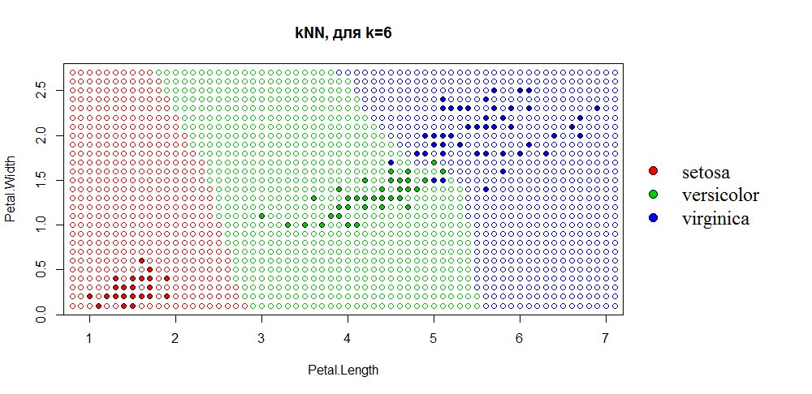

```R
kNN <- function(xl, z, k, metricFunction = euclideanDistance)
{
  n <- dim(xl)[2] - 1
  distances <- apply(xl[ ,1:n], 1, metricFunction, z) 
  sortedDist <-  sort(distances, index.return=TRUE)
  classes <- xl[sortedDist$ix[1:k], n + 1]
  counts <- table(classes)
  class <- names(which.max(counts))
  return (class)
}
```

[The optimal k for kNN](images/kNN_kOpt.png).
The code resides [here](sourses/kNN.R).

## kwNN
___
Here is introduced the so-called weight function `w(i)`, which in the kNN algorithm was just a constant multiplier is 1. `w(i),` - decreasing function. Here we are again finding `k` nearest neighbors, but now the farther the neighbor, the smaller the contribution he brings to the class definition of the object `u`.

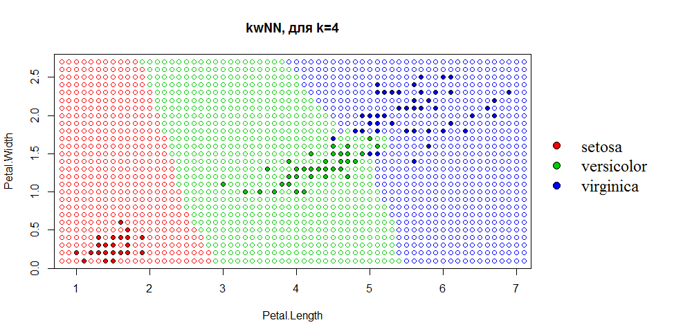

```R
kwNN <- function(xl, z, k, metricFunction = euclideanDistance)
{
  n <- dim(xl)[2] - 1
  distances <- apply(xl[ ,1:n], 1, metricFunction, z) 
  sortedDist <-  sort(distances, index.return=TRUE)
  classes <- xl[sortedDist$ix[1:k], n + 1]
  classesList <- unique(classes)
  counts <- rep(0,length(classesList))
  for (i in 1:k)
  {
    counts[which(classes[i]==classesList)] =
      counts[which(classes[i]==classesList)] + w(i,k)
  }
  as.character(classesList[which.max(counts)])
}
```

[The optimal k for kwNN](images/kwNN_kOpt.png).
The code resides [here](sourses/kwNN.R).

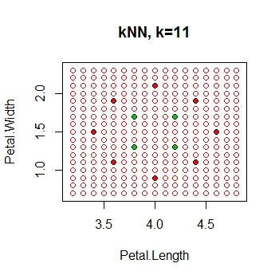 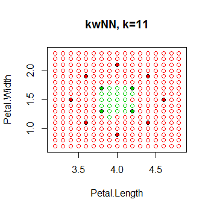

## Parsen window (PW)
___
Imagine that our object `u` is the center of the sphere, and we have expanded the radius of the sphere to the value `h` is the width of the window. Then the more objects `Yi` class will be inside this sphere, the more likely it is that the object `u` is `Yi`. In fact this method is dual to the kNN (kwNN).

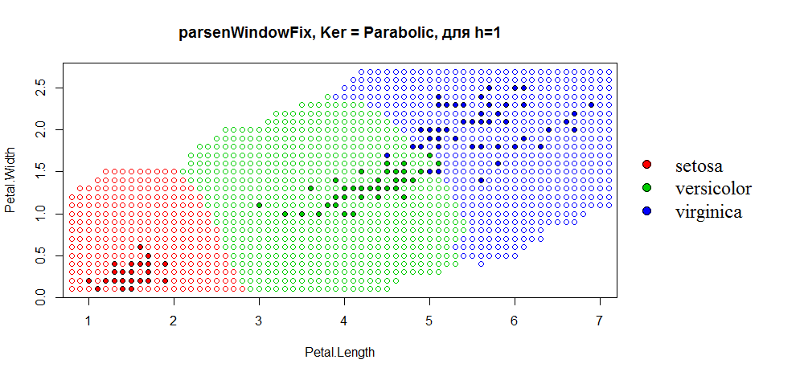

```R
parsenWindowFix <- function(xl, u, h, kerType=ker.type[3])
{
  l <- dim(xl)[1]
  n <- dim(xl)[2] - 1
  classesList <- unique(xl[ , n+1])
  counts <- rep(0,length(classesList))
  for (i in 1:l)
  {
    counts[which(xl[i,n+1]==classesList)] <-
      counts[which(xl[i,n+1]==classesList)] +
      kerne(euclideanDistance(u,xl[i, 1:n])/h,kerType)
  }
  if(max(counts)==0) return("")
  as.character(classesList[which.max(counts)])
}
```

[The optimal h for PW](images/parsenWindowFix_hOpt.png).
The code resides [here](sourses/parsenWindowFix.R).
[Graphic illustration](images/pasrenwindowexample.png).

## PW - h(k)
___
Here the choice of the parameter `h` depends on `k`. So by and large it's the same kNN. Only here, instead of `w(i)` used `Ker(u)` is the kernel function, the integral where = 1 and is also decreasing on the interval `[0,oo]`.

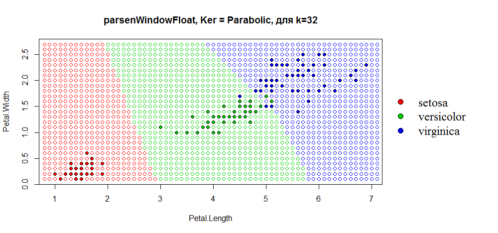

```R
parsenWindowFloat <- function(xl, u, k, kerType=ker.type[3])
{
  l <- dim(xl)[1]
  n <- dim(xl)[2] - 1
  distances <- matrix(NA, l, 2)
  for (i in 1:l)
  {
    distances[i, ] <- c(i, euclideanDistance(xl[i, 1:n], u))
  }
  pos <- order(distances[, 2])
  orderedXl <- xl[pos, ]
  h <- 1
  for (i in (k+1):l)
  {
    if(distances[pos[i], 2]!=0)
    {
      h <- distances[pos[i], 2]
      break
    }
  }
  classesList <- unique(orderedXl[ , n+1])
  counts <- rep(0,length(classesList))
  for (i in 1:l)
  {
    counts[which(orderedXl[i,n+1]==classesList)] <-
      counts[which(orderedXl[i,n+1]==classesList)] +
      kerne(distances[pos[i], 2]/h,kerType)
  }
  as.character(classesList[which.max(counts)])
}
```

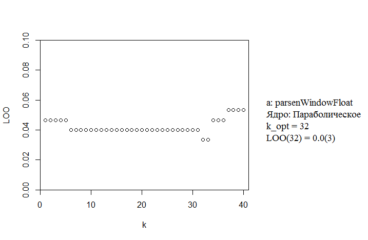

The code resides [here](sourses/parsenWindowFloat.R).

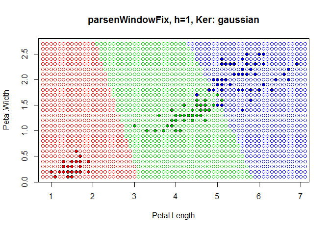 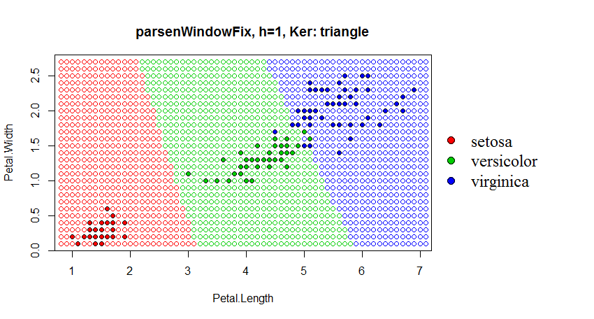 

## Potential functions (PF)
___
Here, too, everything is easy. We carry out an analogy with physical particles (they have a charge and a radius of action of this charge) and assume that each object sample `xl` has a potential (charge) and the distance of its action. Each `i`-th object contributes to the percentage of its class value, which is equal to `potential * ( the degree of actions/object distance u )`.

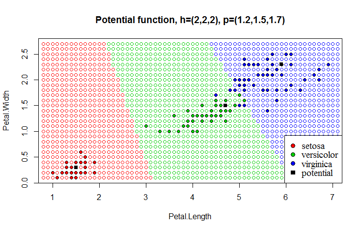

```R
potentialFunc <- function(xl, x, h, gammaV){
  distances <- c()
  wght_to_class <- c()
  for(i in 1:nrow(xl)){
    distances[i] <- euclideanDistance(xl[i , 1:length(xl) - 1] , x)
    wght_to_class[i] <- kerne(distances[i] / h[i], ker.type[7]) * gammaV[i]  
  }
  
  potentional_wght <- data.frame(p_class <- xl$Species, wght_to_class)
  wght_max <- c( sum_setosa <- sum(potentional_wght[potentional_wght$p_class == "setosa" , 2]),
                 sum_versicolor <- sum(potentional_wght[potentional_wght$p_class == "versicolor" , 2]),
                 sum_virginica <- sum(potentional_wght[potentional_wght$p_class == "virginica" , 2]) )
  if(sum(wght_max) == 0){
    
    res <- ""
  }else{
    res <- levels(xl$Species)[match(max(wght_max), wght_max)]
  }
  return(res)
}

getBestGamma <- function(xl, h, gammaV, eps){
  i <- 1
  while(loo_potential(xl, h, gammaV) > eps){
    cur_point <- c(xl[i, 1], xl[i, 2])
    el_class <- xl[i , 3]
    el_check <- potentialFunc(xl, cur_point, h, gammaV)  
    if(el_class != el_check){
      gammaV[i] <-  gammaV[i] + 1
    }
    i <- i + 1
    
  }
  return(gammaV) 
}
```

The code resides [here](sourses/potential.R).

It is useful to read the table below...

| Algorithm                    | The optimal parameter|  LOO   |
| ---------------------------- |:--------------------:|:-------:
| kNN                          | k = 6                |0.03(3) |
| kwNN                         | k = 4                |0.04    |
| PW (h=const)                 | h = 1                |0.04    |
| PW h(k)                      | h = 32               |0.03(3) |
| PF                           | h = 1; g = 1         |0.053(3)|
 

### Comparison of algorithms:
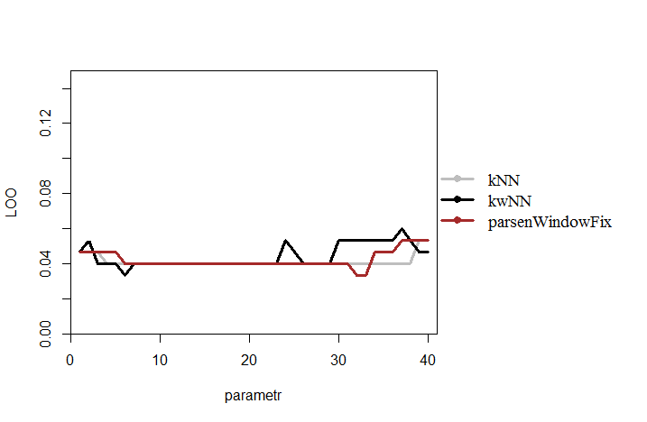

## Margin
___
Roughly speaking `Margin =` degree of closeness of the object `u` to his class `-` the degree of proximity to the nearest NOT of their class.
Calculate the padding of all the elements of the sample `xl`, place the objects in ascending order of margins, and build their schedule:

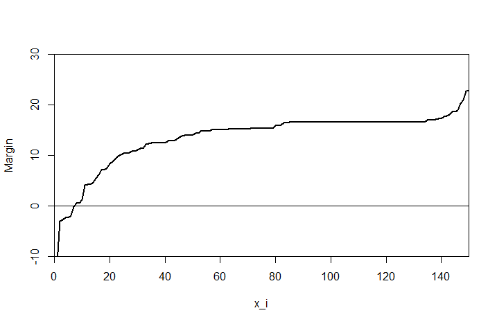
The code resides [here](../general/sourses/Margin.R).

## STOLP
___
This method (optimization) allows to reduce the sample `xl`, throwing out her noise, uninformative features using a specific algorithm, for example, `kNN` function indents `Margin`. I think no need to explain why he is so good...

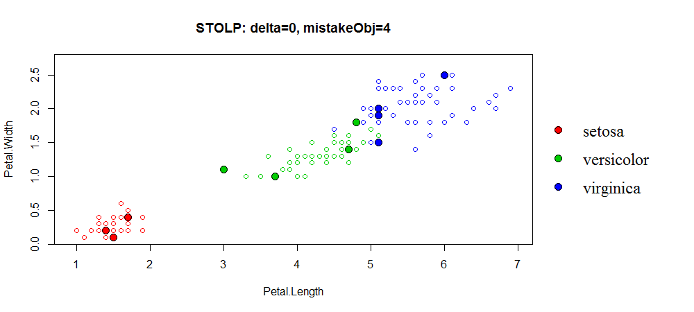

```R
STOLP <- function(xl, delta, eps, metricFunction = euclideanDistance)
{
  n <- dim(xl)[2]-1 #кол-во признаков
  l <- dim(xl)[1] #кол-во объектов выборки
  classesList <- unique(xl[ ,n+1]) #список уникальных классов
  len <- length(classesList)
  vvz <- NULL #каждому классу ставится в соответствие номер
  for(i in 1:len) { vvz[classesList[i]] <- i }
  mar <- rep(NA,len) #список отступов для элементов выборки
  j <- 0
  for(i in 1:l) #отсеиваем выбросы
  {
    if(Margin(xl,i)>=delta)
    {
      j <- j+1
      xl[j, ] <- xl[i, ]
    }
  }
  l <- j
  for(i in 1:l)
  {
    tmp <- Margin(xl[1:l, ],i)
    tmp2 <- vvz[xl[i,n+1]] #номер класса i-го объекта выборки
    #перенумеровываем выборку так, что
    #первые len эл. выборки имеют макс. отступы для каждого класса
    if(is.na(mar[tmp2]) | mar[tmp2]<tmp) #если уже был рассмотрен хотя бы 1 объект
    {#класса с номером tmp2, то...
      #ищем объект с максимальным отступом для этого класса
        mar[tmp2] <- tmp #новый макс. отступ для tmp2 класса
        tmp <- xl[tmp2, ]
        xl[tmp2, ] <- xl[i, ]
        xl[i, ] <- tmp
    }
  }
  delta <- 0
  while(len!=l)
  {
    j <- 0
    mistakeObj <- NA
    for(i in (len+1):l)
    {
      if(kNN(xl[1:len, ],xl[i,1:n],6)!=xl[i,n+1])
      {
        j <- j+1
        mistakeObj[j] <- i
      }
    }
    if(j<eps) break
    mar <- rep(NA,length(classesList))
    index <- rep(NA,length(classesList))
    for(i in mistakeObj)
    {
      tmp3 <- xl[1:len, ]
      tmp3[len+1, ] <- xl[i, ]
      tmp <- Margin(tmp3[1:(len+1), ],len+1)
      tmp2 <- vvz[xl[i,n+1]]
      if(tmp<delta)
      {
        if(is.na(mar[tmp2]) | mar[tmp2]>tmp)
        {
          mar[tmp2] <- tmp
          index[tmp2] <- i
        }
      }
    }
    if(all(is.na(index))) { delta <- delta+1 }
    else { delta <- 0 }
    for(i in index)
    {
      if(!is.na(i))
      {
        len <- len+1
        tmp <- xl[len, ]
        xl[len, ] <- xl[i, ]
        xl[i, ] <- tmp
      }
    }
  }
  xl[1:len, ]
}
```

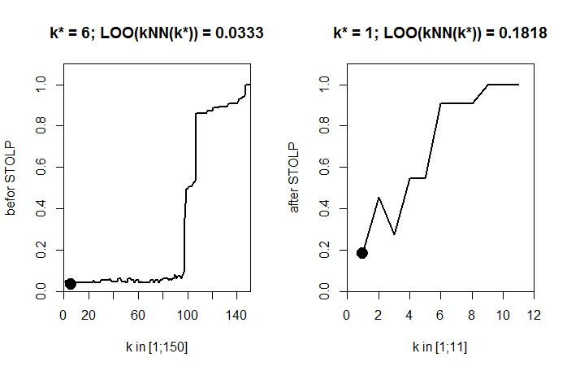

The code resides [here](../general/sourses/STOLP.R).

[loo for kNN before STOLP](../general/images/loo_for_kNN_before_STOLP.png)
[loo for kNN after STOLP](../general/images/loo_for_kNN_after_STOLP.png)