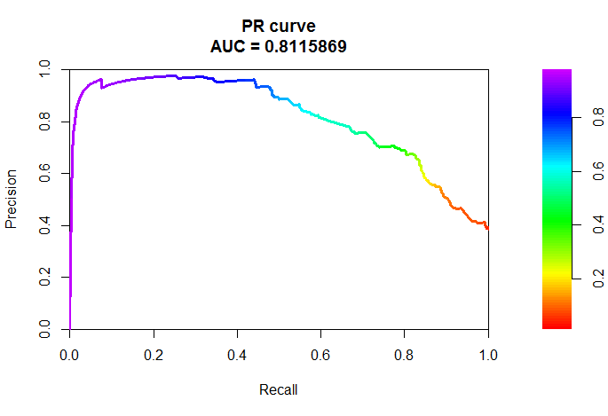
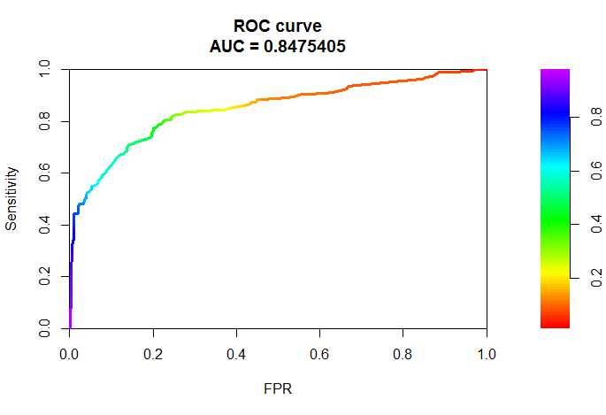
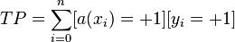
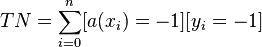
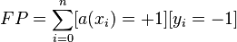
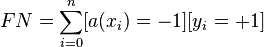

Curve error or ROC-curve – graphic characteristics of quality of a binary probabilistic classifier, the dependence of the proportion of true positive classifications of the proportion of false positive classifications by varying the threshold decision rule. Numerical characteristic ROC - AUC (Area under curve), higher is better, 0.5 - means that our classification is fully random.

Precision-Recall is a useful measure of success of prediction when the classes are very imbalanced. In information retrieval, precision is a measure of result relevancy, while recall is a measure of how many truly relevant results are returned.

The precision-recall curve shows the tradeoff between precision and recall for different threshold.

 

In this example, as a classification algorithm, logistic regression was used.

ROC-curve always starts in (0, 0) and ends at (1, 1).

For numerical representation of quality of evaluations use the error matrix (confusion matrix):

||Predicted = -1|Predicted = +1|
|---|---|---|
|Actual = -1|True Negatives (TN)|False Positives (FP)|
|Actual = +1|False Negatives (FN)|True Positives (TP)|

In the case of binary classification class label **y** takes a value '+1' (positive) or '-1' (negative). Entered 4 values corresponding to the elements of error matrices:

* True positive (TP)  .
* True negative (TN)  .
* False positive (FP)  .
* False negative (FN)  .

P means that the classifier determines the class of the object as a positive (N - negative). T - means the class predicted correctly (accordingly F - wrong).

From here we can obtain two values, which will help us to determine what errors does the model:

_Sensitivity_ = TP/(TP+FN) - (~recall), or **True positive rate (TPR)**. The percentage of correctly predicted classes of the objects belonging to the positive class '+1'.

_Specificity_ = TN/(TN+FP) - **True negative rate (TNR)**. The percentage of correctly predicted classes of the objects belonging to the negative class '-1'.

Model with a higher threshold value will have a higher sensitivity and low specificity. A model with a low threshold the opposite.

False Positive Rate (FPR) = FP/(FP+TN) - is the proportion of incorrectly predicted classes among the objects of the class '-1'.

False Negative Rate (FNR) = FN/(FN+TP).

Precision = TP/(TP+FP).

F.e. will be used a database of survivors/dead passengers of the Titanic. Here is the code ...

```R
#  Read data in dataframe
data <- read.csv("data/train.csv")
# Consider a data structure...
#str(data)
# Replace lines without age by median
data$Age[is.na(data$Age)] <- median(data$Age, na.rm=TRUE)
#Create a model of dependence of survival of a passenger gender, a class which he travels and age.
model = glm(Survived ~ Sex + Pclass + Age, data=data, family = binomial) #binomial means that selected 'logistic regression'
#Consider our model...
#summary(model)

t <- 0.4 #the threshold level

# Using the model to predict on test data
# do not specify the parameter newdata
predictTrain <- predict(model, type="response")
# s <- table(data$Survived,predictTrain > t)
# TP <- s[2,2]
# TN <- s[1,1]
# FP <- s[1,2]
# FN <- s[2,1]
# TPR <- TP / (TP + FN) #sensitivity (~recall)
# FPR <- FP / (FP + TN)
# TNR <- TN / (TN + FP) #specificity
# FNR <- FN / (FN + TP)

# install.packages("PRROC")
require("PRROC")

alive <- predictTrain[ data$Survived == 1 ]
dead <- predictTrain[ data$Survived == 0 ]
pr <- pr.curve(scores.class0 = alive, scores.class1 = dead, curve = T)
plot(pr, xaxs = "i", yaxs = "i")
roc <- roc.curve(scores.class0 = alive, scores.class1 = dead, curve = T)
plot(roc, xaxs = "i", yaxs = "i")
```