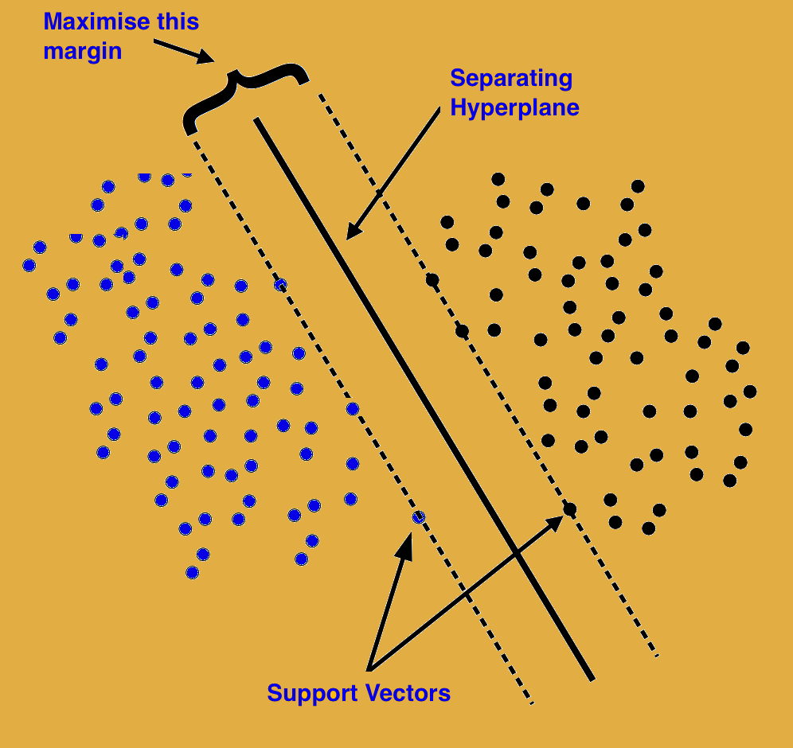
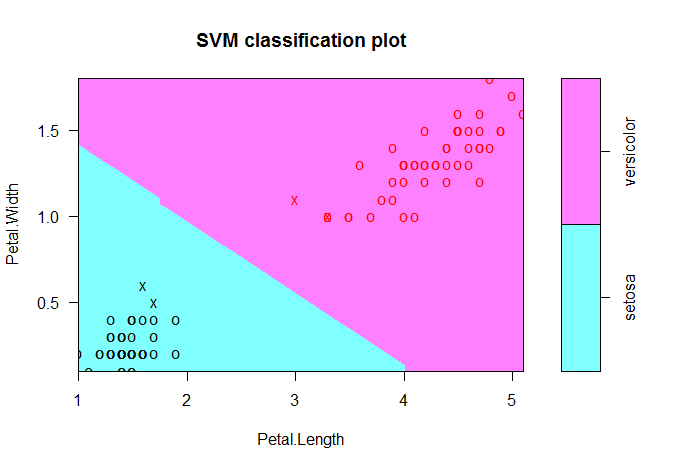
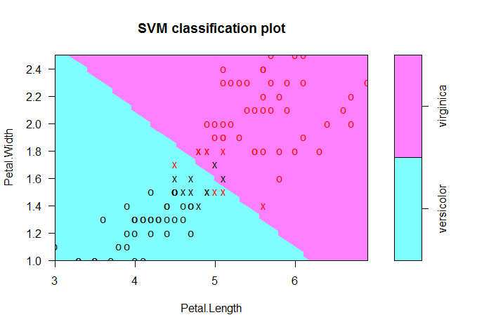
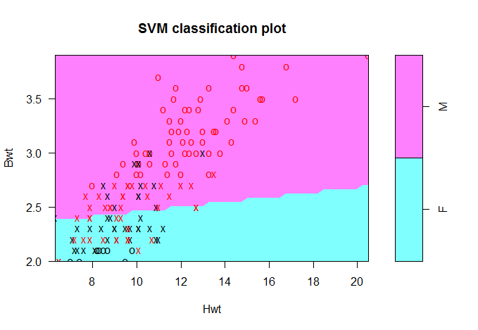

## Support Vector Machine (SVM)
___

### How does SVM work?
Here’s what SVM does in simple terms:

Assuming that your data-points are of 2 classes, SVM attempts to find the optimal line (hyperplane) that maximises the distance (margin) between the closest points from these classes. It is possible that sometimes, the boundary points may cross over the wrong side of hyperplane and overlap, in which case, these points are weighted down to lower their importance.

The ‘support vector’ in this case is the line formed by data points that lie on the margin of separation.



### What happens if a separating line (linear hyperplane) cannot be determined?

The data points are projected on to a higher dimensional space where they may become linearly separable. This is usually framed and solved as a constrained optimization problem, that aims to maximise the margins between the two classes.

### What if my data has more than two classes?

SVM will still view the problem as a binary classification, except this time, multiple SVMs are fitted for classes against each other until all participating classes are differentiated.

### Linear SVM

The key parameters passed to the svm() are kernel, cost and gamma. Kernel is the type of SVM which could be linear, polynomial, radial or sigmoid. Cost is the cost function of constraint violation and gamma is a parameter used by all kernels except linear. There is a type parameter that determines whether the model is used for regression, classification or novelty detection. But this need not be explicitly set as SVM will auto detect this based on the class of response variable being a factor or a continuous variable. So for classification problems, be sure to cast your response variable as a factor.



```R
require("e1071")
require("kernlab")
require("MASS")

data(iris)
svm.data <- iris[ Species!="virginica" ,]
svm.data$Species <- factor(svm.data$Species)
svm.fit <- svm(Species ~ Petal.Length + Petal.Width, data = svm.data, kernel="linea")
plot(svm.fit, svm.data, Petal.Width ~ Petal.Length)

data(iris)
svm.data <- iris[ Species!="setosa" ,]
svm.data$Species <- factor(svm.data$Species)
svm.fit <- svm(Species ~ Petal.Length + Petal.Width, data = svm.data, kernel="linea")
plot(svm.fit, svm.data, Petal.Width ~ Petal.Length)

data(cats, package="MASS")
svm.data <- data.frame(cats[, c(2,3)], response = as.factor(cats$Sex))
svm.fit <- svm(response ~., data = svm.data, kernel = "linear", cost = 10, scale = FALSE)
plot(svm.fit, svm.data)
```



Lets see how to implement a binary classifier using SVM with the cats dataset from MASS package. In this example you will try to predict the sex of a cat using the body weight and heart weight variables.

